# DoubleSlash Architecture

```mermaid
graph TD

    subgraph CLIENT["conquerd-client  (Desktop App)"]
        direction TB

        subgraph UI["QML UI Layer"]
            MW[MainWindow]
            PL[PeerList / SidebarItem]
            CP[ChatPanel]
            CAP[CallPanel]
            RP[RoomPanel / VoiceRail]
            SP[SettingsPage]
            BW[BackupWizard]
            BP[BrowserPanel]
            STATS[StatsPanel / ConnectionStatsChip]
            VID[VideoTile / VideoRegion / VideoPopoutWindow]
        end

        subgraph BRIDGE["cxx-qt Bridge  src/ui/"]
            AB[AppBridge]
            PM[PeerListModel]
            CM[ChatModel]
            RM[RoomModel]
            CALLM[CallModel]
            FM[FileTransferModel]
        end

        subgraph LOGIC["Core Logic"]
            CONN[ConnectionManager]
            AUDIO[CallController]
            SFU_C[SFUClient]
            FT[FileTransfer]
            FTR[FeatureTrustGate]
            UPDATE[GithubUpdater]
            WAC[WebAppClient]
            OLLAMA[OllamaModule]
        end

        subgraph TRANSPORT["Transport Layer"]
            QUIC[QUIC — quinn]
            WS[WebSocket — tungstenite]
            RELAY_C[QuicRelayClient]
            NAT[upnp.rs — router port mapping]
        end

        subgraph ID_LAYER["Identity & Crypto"]
            ID_C[identity.rs — Ed25519 keypair]
            DEVICE_C["device.rs — device keys / signed registry<br/>foundation; no network integration yet"]
            CRYPTO_C[crypto.rs — HKDF / AES-GCM]
            HS_C[handshake.rs]
            TLS_C[quic_tls.rs — self-signed cert]
        end

        subgraph STORE["Persistence"]
            PS_C[peer_store — trust graph]
            CS[chat_store — SQLite]
            RS[room_store — my_rooms.dat AES-GCM]
            SET[settings.json]
            BACKUP["backup.rs + backup/service.rs<br/>streaming encrypted archive / staged restore / profile selection"]
        end

        subgraph AUDIO_PIPE["Audio Pipeline"]
            CPAL_IO[CPAL — audio I/O]
            AEC_R[aec.rs — NLMS echo cancel]
            JB[Jitter Buffer]
        end

        subgraph MEDIA["Media Layer — video + shared audio"]
            VCAP["video/camera + screen
MF / V4L2 / AVFoundation
Windows.Graphics.Capture"]
            VCODEC["video/codec
MF H.264 (Win) / VP8 (all)"]
            VFRAG["video/fragment + sender
fragmentation, per-frame sig, ABR"]
            VRECV[video/receiver — per-sender decode]
            CCAP["content_capture — WASAPI loopback
system or per-application"]
            CPLAY[content_sender / content_playout]
            MCLK[media_clock — one clock per session]
            MSYNC[media_sync — audio-led hold/drop]
        end
    end

    subgraph SUPERNODE["conquerd-supernode  (Server)"]
        direction TB
        SIG[signaling.rs — WebSocket handler]
        HS_S[handshake.rs]
        REL_S[relay.rs — QUIC forwarder]
        SFU_S[sfu.rs — SFU room mux]
        TICKET[ticket.rs — relay tickets]
        WAM[web_app_module.rs — portal over QUIC]
        ACCESS[access.rs — attestation policy]
        PS_S[peer_store — endpoint mailbox]
        CFG[config.rs — TOML]
    end

    subgraph FEATURES["conquerd-features  (Shared Library)"]
        REG[FeatureRegistry]
        DESC[CapabilityDescriptor]
        QUOTA[QuotaSystem — token buckets]
        CF[ChannelFraming — 1-byte tag]
        WK["WellKnown caps
core.audio.opus / core.chat.v1 / core.file.v1
core.video.v1 / core.audio.content.v1
room.audio.sfu / room.video.sfu
room.audio.content.sfu
web.host.app.v1 / game.relay.v1"]
        VCODEC_NEG[video_codec — frozen wire bytes + negotiate]
    end

    subgraph OPUS_LIB["conquerd-opus  (Audio Codec)"]
        ENC[OpusEncoder — 48kHz / 128kbps]
        DEC[OpusDecoder — FEC / PLC]
        LIBOPUS[libopus C — DRED / OSCE]
    end

    subgraph VPX_LIB["conquerd-vpx  (Video Codec)"]
        VPX[Vp8Encoder / Vp8Decoder]
        LIBVPX["libvpx C — VP8, generic arch
built by our build.rs, no SIMD"]
        MFT["Media Foundation H.264
Windows only — OS-held AVC licence"]
    end

    subgraph INSTALLER["conquerd-installer  (Updater GUI)"]
        IGUI[egui window]
        GH_API[github.rs — release polling]
        EXTRACT[extract.rs — 7z]
        SIGN[sign-release-manifest]
    end

    subgraph PORTAL["In-app portal games"]
        SDK[web-sdk / conquerd.mjs]
        GAMES["games/
brick-breaker
shared-drawing
example"]
    end

    subgraph EXTERNAL["External"]
        GH_REL[GitHub Releases API]
        OS_KR[OS Keyring]
        OLLAMA_E[Ollama — local AI]
    end

    %% ── UI → Bridge ──────────────────────────────────────
    MW & STATS --> AB
    PL --> PM & AB
    CP --> CM & AB
    CAP --> CALLM & AB
    RP --> RM & AB
    SP --> AB
    BW --> AB
    BP --> WAC
    FM --> AB

    %% ── Bridge → Logic / Store ───────────────────────────
    AB --> CONN & FTR & UPDATE & OLLAMA
    AB --> BACKUP
    ANDROID_BACKUP["Android BackupDialog<br/>existing JNI JSON channel"] --> BACKUP
    BACKUP --> ID_C & PS_C & CS & RS & SET
    BACKUP --> ARCHIVE["User-selected .dbackup file<br/>Argon2id + authenticated AES-GCM frames"]
    PM --> PS_C
    CM --> CS
    RM --> RS
    RM --> SFU_C
    CALLM --> AUDIO

    %% ── Logic → Transport ────────────────────────────────
    CONN --> QUIC & WS & HS_C
    QUIC --> RELAY_C
    RELAY_C --> NAT
    SFU_C --> QUIC
    FT --> QUIC
    AUDIO --> QUIC

    %% ── Identity & TLS ───────────────────────────────────
    HS_C --> ID_C & CRYPTO_C
    QUIC --> TLS_C
    ID_C --> OS_KR

    %% ── Audio Pipeline ───────────────────────────────────
    AUDIO --> CPAL_IO & AEC_R & JB
    AUDIO --> ENC & DEC
    ENC & DEC --> LIBOPUS

    %% ── Media Layer (video + audio shared with it) ───────
    AB --> VCAP & CCAP
    VCAP --> VCODEC --> VFRAG --> QUIC
    VCODEC --> VPX & MFT
    VPX --> LIBVPX
    CCAP --> CPLAY --> QUIC
    MCLK --> VFRAG & CPLAY
    QUIC --> VRECV --> MSYNC
    CPLAY --> ENC
    MSYNC -.->|"audio-led anchor"| VID

    %% ── Feature System (client) ──────────────────────────
    FTR --> REG
    SFU_C --> REG
    FT --> REG
    REG --> DESC & QUOTA & CF & WK
    WK --> VCODEC_NEG
    VCODEC --> VCODEC_NEG

    %% ── Client → Supernode ───────────────────────────────
    WS -->|"WebSocket — signaling"| SIG
    QUIC -->|"QUIC datagrams — relay"| REL_S
    QUIC -->|"QUIC datagrams — SFU audio"| SFU_S
    WAC -->|"HTTP / d://"| WAM

    %% ── Supernode internals ──────────────────────────────
    SIG --> HS_S & PS_S & ACCESS
    HS_S --> ACCESS
    REL_S --> TICKET & ACCESS
    SFU_S --> ACCESS & WK
    WAM --> WK
    CFG --> SIG & REL_S & SFU_S

    %% ── Supernode uses features ──────────────────────────
    SFU_S & WAM --> REG

    %% ── In-app portal games ──────────────────────────────
    GAMES --> SDK
    SDK -->|"portal channel + QUIC relay"| REL_S
    BP -.->|"renders d:// pages"| GAMES

    %% ── Installer ────────────────────────────────────────
    IGUI --> GH_API & EXTRACT
    GH_API --> GH_REL
    UPDATE --> GH_REL
    SIGN -.->|"signs release manifest"| GH_REL

    %% ── External ─────────────────────────────────────────
    OLLAMA --> OLLAMA_E

    %% ── Style ────────────────────────────────────────────
    classDef box fill:#1e1e2e,stroke:#585b70,color:#cdd6f4
    classDef ext fill:#11111b,stroke:#45475a,color:#a6adc8,stroke-dasharray:4 4
    classDef shared fill:#1e1e2e,stroke:#89b4fa,color:#89b4fa
    class MW,PL,CP,CAP,RP,SP,BP,STATS box
    class AB,PM,CM,RM,CALLM,FM box
    class CONN,AUDIO,SFU_C,FT,FTR,UPDATE,WAC,OLLAMA box
    class QUIC,WS,RELAY_C,NAT box
    class ID_C,CRYPTO_C,HS_C,TLS_C box
    class PS_C,CS,RS,SET box
    class CPAL_IO,AEC_R,JB box
    class VCAP,VCODEC,VFRAG,VRECV,CCAP,CPLAY,MCLK,MSYNC box
    class SIG,HS_S,REL_S,SFU_S,TICKET,WAM,ACCESS,PS_S,CFG box
    class REG,DESC,QUOTA,CF,WK,VCODEC_NEG shared
    class ENC,DEC,LIBOPUS shared
    class VPX,LIBVPX,MFT shared
    class IGUI,GH_API,EXTRACT,SIGN box
    class SDK,GAMES box
    class GH_REL,OS_KR,OLLAMA_E ext
```

## Component Summary

| Crate / Module | Role |
|---|---|
| **conquerd-client** | Rust/QML desktop app; owns all UI, media, and peer-to-peer logic |
| **conquerd-supernode** | Standalone server: WebSocket signaling, QUIC relay, SFU, in-app portal |
| **conquerd-features** | Shared capability registry, channel framing, quota enforcement, video-codec negotiation |
| **conquerd-opus** | Rust wrapper around libopus (DRED / OSCE neural models) |
| **conquerd-vpx** | Rust wrapper around a vendored libvpx (VP8 on every platform; built without libvpx's own `configure`/`make`) |
| **conquerd-installer** | Cross-platform egui updater GUI; polls GitHub Releases |
| **conquerd-supernode-manager** | Separate workspace: cluster provisioning, `cluster-sync`, `build-deploy`, remote `exec` |
| **web-sdk** | In-app portal game SDK (identity QUIC channel APIs) |
| **games/** | Demo multiplayer games opened only via `d://` portal |

## Key Data Flows

| Flow | Path |
|---|---|
| Peer message | QML → AppBridge → ConnectionManager → tagged QUIC peer stream, or supernode relay fallback → peer |
| Direct voice audio | CPAL mic → AEC/noise/VAD → OpusEncoder → direct QUIC datagram → peer → JitterBuffer → OpusDecoder → CPAL speaker |
| Room voice audio | CPAL mic → OpusEncoder → QuicRelayClient room datagram → supernode SFU/relay fan-out → peers |
| Video | Camera/screen capture → composite (PiP drawn before encode) → H.264 or VP8 → fragments stamped with the session clock and signed → `VIDEO_TAG` direct datagram, or `ROOM_VIDEO_TAG` sealed under the room sender key → opaque relay fan-out → per-sender decode |
| Audio shared with a video | WASAPI loopback (system or one application) → OpusEncoder in `audio` mode → PTS from the same session clock → `CONTENT_AUDIO_TAG` / `ROOM_CONTENT_AUDIO_TAG` → receiver jitter buffer → playout anchor |
| A/V sync | Content-audio playout sets a per-sender anchor → `media_sync` extrapolates between anchors → video is held or dropped to meet it; with no anchor (camera-only call) video free-runs |
| File transfer | FileTransfer module → FeatureRegistry quota gate → `core.file.v1` / `room.file.v1` reliable signaling path |
| Portal game | games/index.html → web-sdk.mjs → window.conquerd channel → client QUIC relay → supernode game session fan-out |
| Identity handshake | identity.rs (Ed25519) → handshake.rs (X25519 ECDH) → HKDF → AES-GCM session |
| Auto-update | GithubUpdater → GitHub Releases API → conquerd-installer (extract + apply) |
